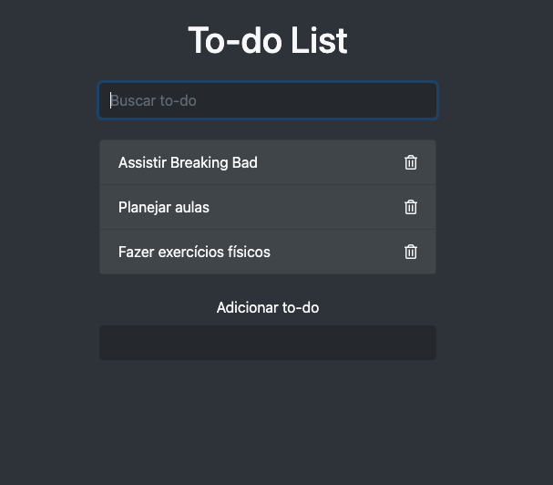

<h1 align="center">
    <h1 align="center">Todo-List</h1>
</h1>

<h1 align="center">
    
</h1>


# Indice

- [Indice](#indice)
  - [🔖&nbsp; Sobre](#-sobre)
  - [🚀 Tecnologias utilizadas](#-tecnologias-utilizadas)
  - [🗂 Como baixar o projeto](#-como-baixar-o-projeto)

## 🔖&nbsp; Sobre

O projeto **Todo-List** é um agendador de tarefas que foi criado durante o treinamento CJRM  

---

## 🚀 Tecnologias utilizadas

O projeto foi desenvolvido utilizando as seguintes tecnologias

- [HTML](https://www.w3schools.com/html/)
- [CSS](https://www.w3schools.com/css/)
- [Javascript](https://developer.mozilla.org/pt-BR/docs/Web/JavaScript)

---

## 🗂 Como baixar o projeto

```bash

    # Clonar o repositório
    $ git clone https://github.com/rogerioopaiva/todo-list.git

    # Entrar no diretório
    $ cd todo-list

    # abrir o arquivo index.html diretamente no browser ou através de um servidor local
    $ abrir index.html
```

---

<p align="center">Desenvolvido  por Rogerio Paiva</p>
